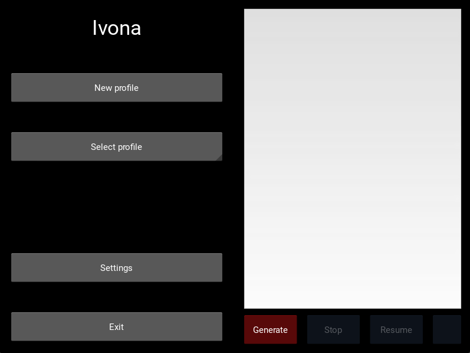
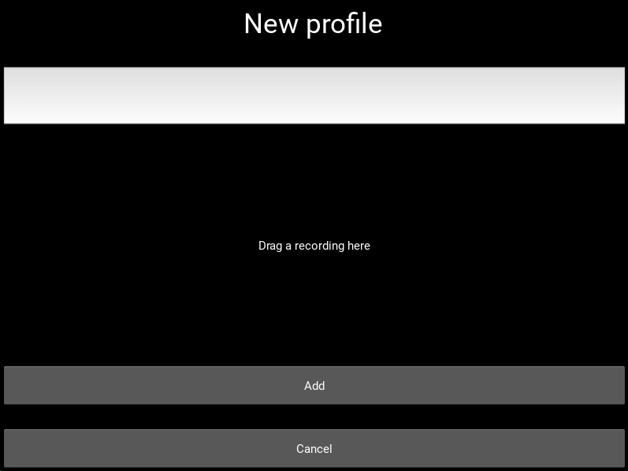

# Ivona - GUI text to speech
[](https://www.python.org)
|
[](https://www.python.org)

## Overview 📃
This project is a simple window application that allows
to quickly convert text to speech.
It uses two models:
- **Eleven Multilingual V2** from **<a href="https://elevenlabs.io/">Eleven Labs</a>** API
- **XTTSv2** from **<a href="https://github.com/coqui-ai/TTS">Coqui TTS</a>** API repository

Both models are multilingual and can be used to convert text to speech in multiple languages.

## Installation 🛠
1. Clone the repository or download the zip file from latest <a href="https://github.com/mddzi77/Ivona/releases">release</a>.
2. Coqui TTS package requires installing <a href="https://visualstudio.microsoft.com/pl/visual-cpp-build-tools/">Visual C++ Build Tools</a> to work properly.
3. Install the required packages using the following command in the project directory
(because of the size of the TTS package it might be necessary to install it manually `pip install TTS`)
```
pip install -r requirements.txt
```
4. Run the application by opening `main.py` file (first launch might take a while, because TTS package need to download the model).
You will be welcomed by the following window:



## Usage 📝➡👄
In settings, you can choose the model you want to use for the conversion, as well as the app <a href="#languages">language</a>.

### Creating a new profile
1. Click on the `New profile` button.
2. Enter the profile name and provide voice sample *.wav* file (preferably at least 30 seconds long).
3. Click on the `Add` button, profile will use the model set in the settings.


### Converting text to speech
1. Select the profile from the list from `Select profile` dropdown.
2. Enter the text or drag a pdf file to the text field.
3. Click on the `Generate` to generate audio
4. After generating you can either play or save the file (stop and play currently working only with *built-in* model).


<h3 id="#languages">Languages</h3>
Supported application languages:
- polish
- english

## Future 💭
- [ ] Reset generated audio
- [ ] Better integration with coqui TTS
- [ ] ElevenLabs API actualization
- [ ] Better audio player
